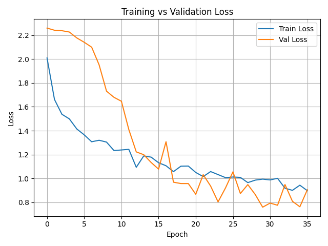
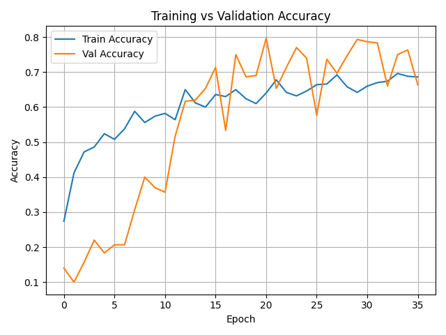
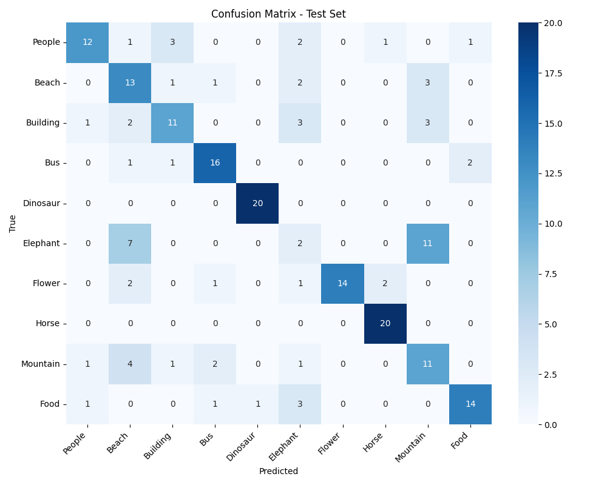

Baik, kita putar kaset **PHASE 7** lagi. Ini isi `README.md` lengkap, tinggal tempel di file `README.md` di root project.

````markdown
# Klasifikasi Gambar SIMPLIcity dengan CNN

Proyek ini adalah praktikum image classification menggunakan **Convolutional Neural Network (CNN)** pada dataset **SIMPLIcity** (1000 gambar, 10 kelas semantik).  
Seluruh eksperimen menggunakan **TensorFlow 2.x (tf.keras)** pada CPU.

## Deskripsi Singkat

- **Dataset**: SIMPLIcity, berisi 1000 gambar warna dengan resolusi sekitar 256×384 / 384×256, dibagi menjadi:
  - `train/`
  - `validation/`
  - `test/`
- **Jumlah kelas**: 10.
- **Penamaan file**: `k.jpg` dengan `k` integer 0–999.
- **Aturan label** (asumsi):

  ```text
  index = k
  class_id = index // 100

  0–99    -> class 0
  100–199 -> class 1
  ...
  900–999 -> class 9
````

* **Tujuan**:

  * Membangun pipeline lengkap klasifikasi gambar mulai dari preprocessing, training, sampai evaluasi.
  * Menjadi dasar praktikum/latihan untuk mahasiswa S1 di topik Deep Learning & Computer Vision.

## Arsitektur Model

Model CNN yang digunakan:

* **Input**: 224 × 224 × 3 (RGB)

* **Preprocessing**:

  * Resize + padding:

    * Landscape (width > height):
      resize → 224 × 150, lalu pad 37 px atas & 37 px bawah → 224 × 224.
    * Portrait (height > width):
      resize → 150 × 224, lalu pad 37 px kiri & 37 px kanan → 224 × 224.
    * Square-ish: resize langsung ke 224 × 224.
  * Normalisasi piksel: `float32`, skala 0–1.
  * Augmentasi (hanya `train`):

    * Random rotation ±~15°
    * Random horizontal flip
    * Random brightness ±10%

* **CNN**:

  * Conv Block 1:

    * Conv2D(16, 3×3, stride 1, padding `"same"`)
    * BatchNormalization
    * ReLU
  * Conv Block 2:

    * Conv2D(32, 3×3, stride 1, padding `"same"`)
    * BatchNormalization
    * ReLU
  * Conv Block 3:

    * Conv2D(64, 3×3, stride 1, padding `"same"`)
    * BatchNormalization
    * ReLU
  * GlobalAveragePooling2D
  * Dropout(0.5)
  * Dense(10, activation=`softmax`)

* **Training setup**:

  * Optimizer: Adam (learning rate awal: 1e-3) dengan ExponentialDecay.
  * Loss: Categorical Crossentropy.
  * Metric: Accuracy.
  * Batch size: 16.
  * Epochs: maksimal 50.
  * EarlyStopping:

    * `monitor = "val_loss"`
    * `patience = 6`
    * `restore_best_weights = True`.

## Kebutuhan Lingkungan

* **OS**: Fedora 40 (Linux).
* **Python**: disarankan Python 3.12.
* **Framework utama**: TensorFlow 2.17.x (CPU, `tf.keras`).
* **Tool tambahan**:

  * `git`, `cmake`, `ffmpeg`
  * library grafis: `mesa-libGL`, dsb.

## Struktur Proyek

```text
simplicity_cnn/
│
├── data/
│   └── SIMPLIcity/              # symlink ke dataset asli
│       ├── train/
│       ├── validation/
│       └── test/
│
├── src/
│   ├── __init__.py
│   ├── config.py                # path & hyperparameter
│   ├── utils.py                 # seeding, plotting, helper
│   ├── dataset.py               # loader tf.data + preprocessing + augmentasi
│   ├── model.py                 # definisi CNN (Keras)
│   ├── train.py                 # script training (model.fit, callbacks)
│   └── evaluate.py              # evaluasi test set + confusion matrix
│
├── notebooks/
│   ├── 01_explore_dataset.ipynb
│   ├── 02_train_model.ipynb
│   └── 03_eval_and_visualize.ipynb
│
├── outputs/
│   ├── logs/                    # riwayat training (CSV/JSON)
│   ├── models/                  # saved models (best, last)
│   └── figures/                 # loss.png, accuracy.png, confusion_matrix_test.png
│
├── report/                      # untuk laporan akhir (diisi manual)
│
├── requirements.txt
└── README.md
```

## Menjalankan Training via Script

1. Aktifkan virtualenv:

   ```bash
   cd ~/simplicity_cnn
   source .venv/bin/activate
   ```

2. Jalankan training:

   ```bash
   python src/train.py
   ```

3. Output yang dihasilkan:

   * Model terbaik (berdasarkan `val_accuracy`):

     ```text
     outputs/models/simplicity_cnn_tf_best.h5
     ```

   * Model terakhir (epoch terakhir):

     ```text
     outputs/models/simplicity_cnn_tf_last.h5
     ```

   * Riwayat training:

     ```text
     outputs/logs/train_history.csv
     outputs/logs/train_history.json
     ```

   * Plot loss & accuracy:

     ```text
     outputs/figures/loss.png
     outputs/figures/accuracy.png
     ```

## Menjalankan Evaluasi via Script

Setelah training selesai dan best model tersimpan:

```bash
cd ~/github/neuralcomp/simplicity_cnn
source .venv/bin/activate

python src/evaluate.py
```

Script ini akan:

* Load best model dari `outputs/models/simplicity_cnn_tf_best.h5`.

* Menghitung:

  * `test_loss`
  * `test_accuracy`
  * `error_ratio = 1 - test_accuracy`

* Membuat confusion matrix:

  ```text
  outputs/figures/confusion_matrix_test.png
  ```

* Menghasilkan visualisasi contoh prediksi:

  ```text
  outputs/figures/sample_predictions_test.png
  ```

## Menjalankan Notebook

### A. JupyterLab

```bash
cd ~/github/neuralcomp/simplicity_cnn
source .venv/bin/activate
jupyter lab
```

Lalu:

1. Buka notebook di folder `notebooks/`.
2. Pilih kernel **simplicity_cnn**.
3. Jalankan cell sesuai urutan:

   * `01_explore_dataset.ipynb`
   * `02_train_model.ipynb`
   * `03_eval_and_visualize.ipynb`

### B. VS Code

1. Buka folder `simplicity_cnn` di VS Code.
2. Buka salah satu notebook.
3. Klik **Select Kernel** di pojok kanan atas.
4. Pilih:

   * Jupyter Kernel **`simplicity_cnn`**, atau
   * Python interpreter yang mengarah ke `.venv/bin/python`.

Jika kernel belum muncul:

```bash
cd ~/simplicity_cnn
source .venv/bin/activate
python -m ipykernel install --user --name simplicity_cnn --display-name "simplicity_cnn"
```

Restart VS Code / Jupyter, lalu pilih kembali kernel tersebut.

## Ringkasan File Penting

* `src/config.py` – Hyperparameter global dan path dataset/output.
* `src/dataset.py` – Loader dataset berbasis `tf.data` dengan resize + padding 224×224 dan augmentasi.
* `src/model.py` – Definisi arsitektur CNN (3 conv block + GAP + Dropout + Dense 10).
* `src/train.py` – Training loop lengkap: optimizer, callbacks, logging, dan penyimpanan model.
* `src/evaluate.py` – Evaluasi test set, confusion matrix, dan visualisasi prediksi.
* `notebooks/01_explore_dataset.ipynb` – Eksplorasi struktur dataset & distribusi kelas.
* `notebooks/02_train_model.ipynb` – Orkestrasi training model dari notebook.
* `notebooks/03_eval_and_visualize.ipynb` – Evaluasi model & analisis visual.

* **Grafik Loss**
    

* **Grafik Akurasi**
    

* **Confusion Matrix**
    

* **Contoh Prediksi**
    


